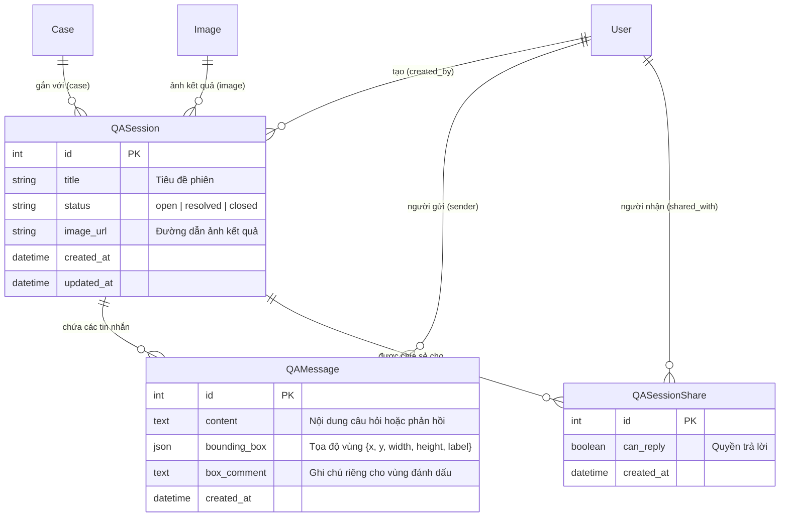
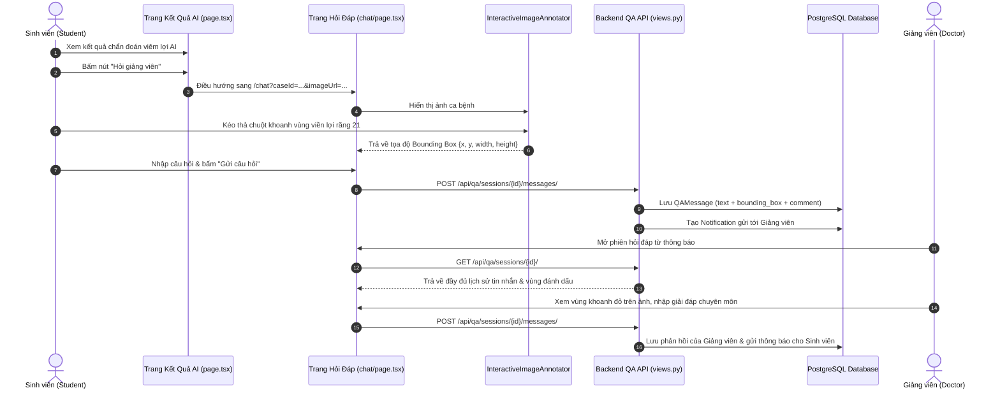

# TÀI LIỆU HỆ THỐNG HỎI ĐÁP GIỮA SINH VIÊN VÀ GIẢNG VIÊN (DentAI Q&A System)

Tài liệu này mô tả chi tiết kiến trúc, các file thay đổi, cấu trúc cơ sở dữ liệu và mối liên hệ giữa các thành phần trong tính năng **Hỏi đáp & Trao đổi kết quả chẩn đoán AI** dành cho **Sinh viên (`student`)** và **Giảng viên / Bác sĩ (`doctor`)**.

---

## 1. Tổng quan Nghiệp vụ

Sau khi sử dụng tính năng AI hỗ trợ chẩn đoán hình ảnh (ví dụ: phát hiện viêm lợi, viền răng, mảng bám):
1. **Sinh viên** xem ảnh kết quả AI, bấm nút **"Hỏi giảng viên"** trên thanh công cụ.
2. Hệ thống chuyển tới màn hình **Hỏi đáp & Trao đổi** (`/chat`), tải sẵn ảnh kết quả ca bệnh.
3. Sinh viên có thể dùng chuột **kéo thả vẽ Bounding Box** lên vùng răng / lợi cụ thể cần hỏi, nhập **ghi chú cho vùng** và nội dung câu hỏi.
4. **Lưu trữ Persistent (giống Zalo / Messenger)**: Mọi câu hỏi, phản hồi và tọa độ vùng đánh dấu được lưu trữ vĩnh viễn trong cơ sở dữ liệu PostgreSQL. Khi chuyển trang, ẩn giao diện hoặc tải lại đều không bị mất.
5. **Chia phiên thảo luận (giống ChatGPT / Claude)**: Mỗi ca bệnh hoặc mỗi vấn đề có thể chia thành các phiên riêng biệt với tiêu đề, trạng thái (*Đang mở*, *Đã giải đáp*, *Đã đóng*).
6. **Chia sẻ phiên (Collaboration)**: Sinh viên hoặc giảng viên có thể chia sẻ phiên hỏi đáp cho các sinh viên hoặc giảng viên khác để cùng tham gia thảo luận nhóm.
7. **Phản hồi từ Giảng viên (người thật)**: Giảng viên nhận thông báo, mở phiên để xem trực quan vùng sinh viên đã khoanh vùng và gửi phản hồi hướng dẫn chuyên môn.

---

## 2. Danh sách các File Thay đổi & Tạo mới

### 2.1. Backend (Django REST Framework)

| File | Hành động | Vai trò / Chức năng |
| :--- | :--- | :--- |
| `apps/qa/__init__.py` | **MỚI** | Khởi tạo module Django app `apps.qa`. |
| `apps/qa/apps.py` | **MỚI** | Khai báo cấu hình `QAConfig` cho ứng dụng hỏi đáp. |
| `apps/qa/models.py` | **MỚI** | Định nghĩa 3 Models chính: `QASession` (phiên hỏi đáp), `QAMessage` (tin nhắn + bounding box + comment), `QASessionShare` (chia sẻ phiên). |
| `apps/qa/serializers.py` | **MỚI** | Serializer chuyển đổi dữ liệu ORM sang JSON và ngược lại, định dạng thông tin người gửi, tin nhắn gần nhất, danh sách chia sẻ. |
| `apps/qa/views.py` | **MỚI** | ViewSet `QASessionViewSet`: Xử lý tạo phiên, gửi tin nhắn, đánh dấu vùng ảnh, tìm kiếm, phân quyền truy cập, bắn thông báo (`notify_user`). |
| `apps/qa/urls.py` | **MỚI** | Khai báo route RESTful: `/api/qa/sessions/`, `/api/qa/sessions/{id}/messages/`, `/api/qa/sessions/{id}/share/`. |
| `apps/qa/tests.py` | **MỚI** | Kiểm thử tự động (Unit Test) xác thực quyền của sinh viên, giảng viên trả lời câu hỏi và chia sẻ phiên. |
| `config/settings.py` | **SỬA** | Đăng ký `"apps.qa"` vào `INSTALLED_APPS`. |
| `config/urls.py` | **SỬA** | Định tuyến `path("api/", include("apps.qa.urls"))`. |

### 2.2. Frontend (Next.js 14 + React + TypeScript + Tailwind CSS)

| File | Hành động | Vai trò / Chức năng |
| :--- | :--- | :--- |
| `src/lib/qa.ts` | **MỚI** | Định nghĩa kiểu TypeScript (`BoundingBox`, `QAMessage`, `QASessionDetail`, `QAShareItem`) và API Client `qaApi`. |
| `src/components/qa/InteractiveImageAnnotator.tsx` | **MỚI** | Component tương tác đồ họa trên ảnh: Kéo thả chuột vẽ bounding box, hiển thị các vùng đã đánh dấu, tooltip tên người đánh dấu và comment. |
| `src/components/qa/QASidebar.tsx` | **MỚI** | Cột bên trái hiển thị danh sách các phiên hỏi đáp (như ChatGPT), ô tìm kiếm, bộ lọc tab (*Tất cả*, *Cần giải đáp*, *Của tôi*, *Được chia sẻ*), trạng thái phiên. |
| `src/components/qa/QAChatPanel.tsx` | **MỚI** | Khung chat chính: luồng tin nhắn câu hỏi / phản hồi, liên kết trực quan giữa tin nhắn và tọa độ vùng ảnh, khung soạn thảo, phím tắt `Ctrl + Enter`. |
| `src/components/qa/QAShareModal.tsx` | **MỚI** | Hộp thoại tìm kiếm sinh viên / giảng viên trên hệ thống để chia sẻ phiên hỏi đáp hoặc thu hồi quyền chia sẻ. |
| `src/components/qa/NewSessionModal.tsx` | **MỚI** | Modal tạo phiên hỏi đáp mới kèm tiêu đề, ảnh ca bệnh và câu hỏi ban đầu. |
| `src/app/(main)/chat/page.tsx` | **SỬA** | Chuyển đổi từ trang giữ chỗ thành màn hình làm việc Hỏi đáp hoàn chỉnh, hỗ trợ auto-polling cập nhật tin nhắn mới, lưu trạng thái liên tục. |
| `src/components/layout/Sidebar.tsx` | **SỬA** | Cập nhật nhãn menu `/chat` thành **"Hỏi đáp & Trao đổi"** cho toàn bộ người dùng. |
| `src/app/(main)/analysis/[caseId]/results/[imageIndex]/page.tsx` | **SỬA** | Thêm nút **"Hỏi giảng viên"** trên thanh công cụ xem kết quả chẩn đoán AI, tự động chuyển ảnh sang màn hình hỏi đáp. |

---

## 3. Cấu trúc Cơ sở Dữ liệu (Database Models)

---

## 4. Mối liên hệ & Luồng hoạt động giữa các File (Architecture Flow)

---

## 5. Hướng dẫn Sử dụng Nhanh

1. **Sinh viên đặt câu hỏi từ ảnh chẩn đoán**:
   - Vào mục **AI hỗ trợ chẩn đoán lâm sàng** → **Chẩn đoán viêm lợi** (hoặc mở một ca bất kỳ).
   - Trên thanh công cụ, nhấn **"Hỏi giảng viên"**.
   - Nhập tiêu đề hoặc câu hỏi ban đầu để mở phiên.
   - Nhấn nút **"Đánh dấu vùng hỏi"**, kéo rê chuột trên ảnh để khoanh vùng răng hoặc lợi muốn hỏi.
   - Nhập thêm ghi chú vùng (nếu cần) và nhấn **"Gửi câu hỏi"** (hoặc `Ctrl + Enter`).

2. **Giảng viên xem và giải đáp**:
   - Nhấp vào mục **"Hỏi đáp & Trao đổi"** trên thanh menu trái (Sidebar).
   - Chọn tab **"Cần giải đáp"** để lọc nhanh các câu hỏi sinh viên vừa gửi.
   - Nhấp vào tin nhắn có biểu tượng 🎯 để hệ thống tự động làm nổi bật vùng sinh viên đã khoanh trên ảnh.
   - Nhập hướng dẫn chuyên môn và bấm **"Gửi phản hồi"**.
   - Có thể chuyển trạng thái phiên thành **"✅ Đã giải đáp"** khi câu hỏi đã được giải quyết.

3. **Chia sẻ phiên thảo luận nhóm**:
   - Trong phiên đang mở, nhấn nút **"Chia sẻ"** ở góc phải trên.
   - Nhập tên hoặc email của sinh viên/giảng viên khác.
   - Nhấn **"Chia sẻ"**. Người được chia sẻ sẽ lập tức thấy phiên trong tab **"Được chia sẻ"** và có thể cùng nhắn tin trao đổi.
