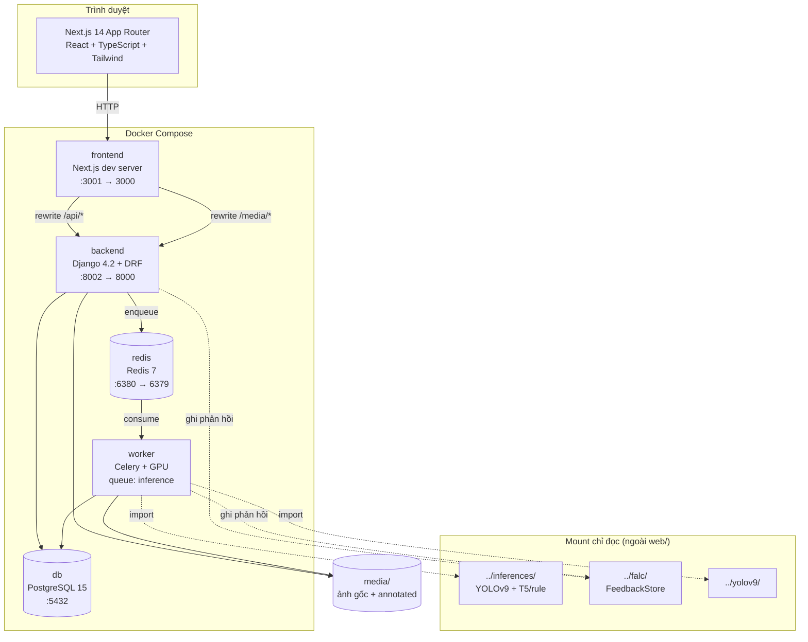
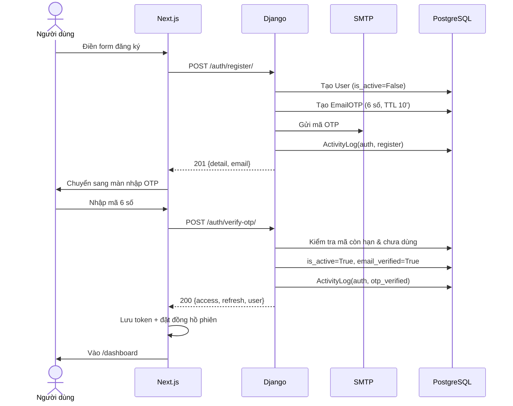
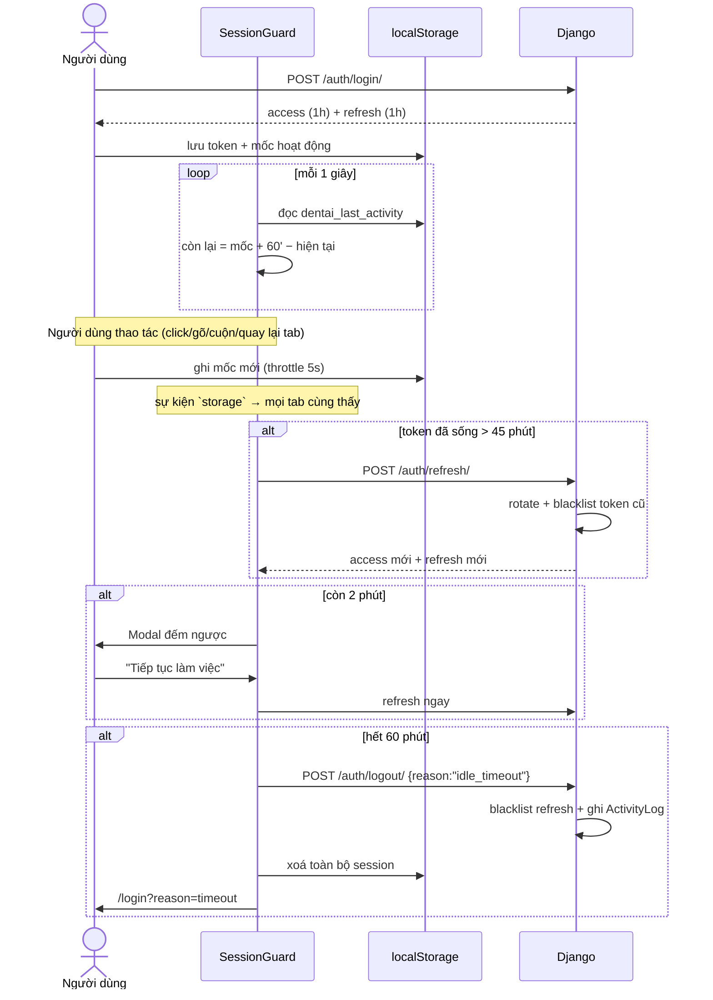
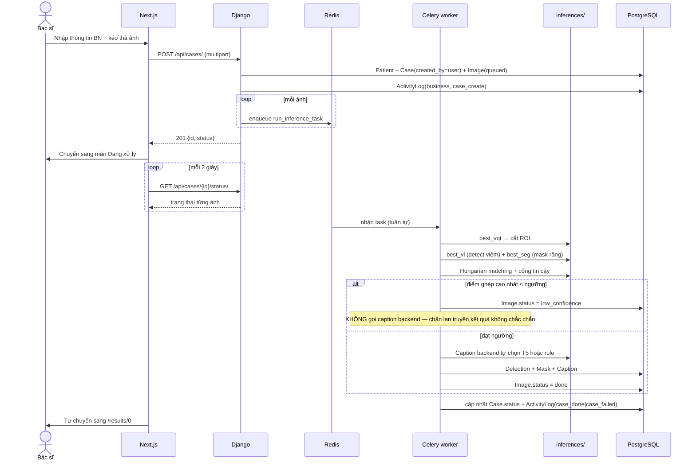
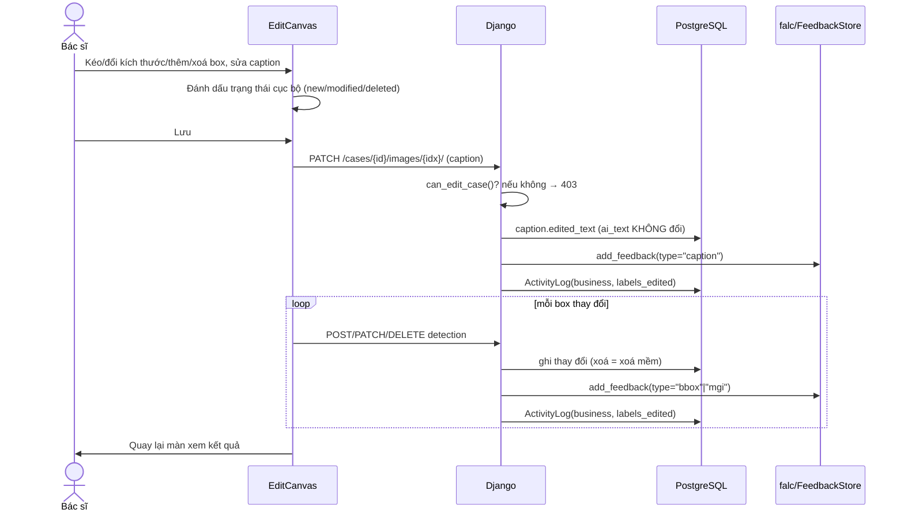
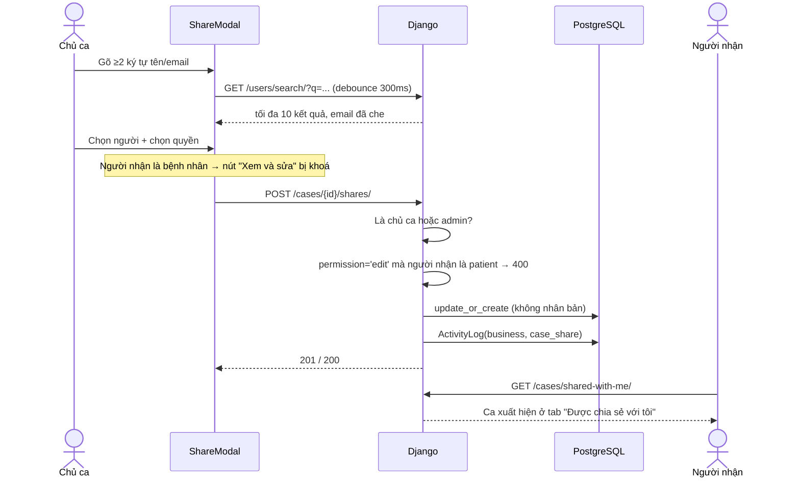

# dentAI Web — Tài liệu thiết kế hệ thống

> Phiên bản: 2026-07-30 · Phạm vi: thư mục `web/` của dự án dentAI
> Tài liệu này mô tả **toàn bộ** ứng dụng web, không chỉ phần mới bổ sung.

---

## Mục lục

1. [Bối cảnh & phạm vi](#1-bối-cảnh--phạm-vi)
2. [Kiến trúc tổng thể](#2-kiến-trúc-tổng-thể)
3. [Tech stack](#3-tech-stack)
4. [Mô hình dữ liệu](#4-mô-hình-dữ-liệu)
5. [Danh mục API](#5-danh-mục-api)
6. [Các luồng xử lý chính](#6-các-luồng-xử-lý-chính)
7. [Ma trận phân quyền](#7-ma-trận-phân-quyền)
8. [Thiết kế bảo mật](#8-thiết-kế-bảo-mật)
9. [Giao diện người dùng](#9-giao-diện-người-dùng)
10. [Triển khai & vận hành](#10-triển-khai--vận-hành)
11. [Hạn chế đã biết & hướng phát triển](#11-hạn-chế-đã-biết--hướng-phát-triển)

---

## 1. Bối cảnh & phạm vi

### 1.1 Bối cảnh

dentAI là hệ thống AI hỗ trợ chẩn đoán **viêm lợi (gingivitis)** từ ảnh nội nha
(intraoral photographs). Hệ thống chấm điểm mức độ viêm cho **từng răng** theo thang
**Modified Gingival Index (MGI 0–4)** trên 12 răng cửa, rồi sinh mô tả lâm sàng bằng
ngôn ngữ tự nhiên.

Ứng dụng web này là **phần minh hoạ (demo)** của dự án. Ba thành phần nghiên cứu chính
nằm ngoài phạm vi tài liệu này:

| Thành phần | Vị trí | Vai trò |
|---|---|---|
| Pipeline suy luận | `../inferences/` | YOLOv9 (ROI → detection → segmentation) + caption lai T5/rule |
| FALC | `../falc/` | Continual learning từ phản hồi bác sĩ sau triển khai |
| YOLOv9 | `../yolov9/` | Mã nguồn mô hình |

> **Quy tắc bất di bất dịch:** mã trong `web/` **không được sửa** bất kỳ file nào thuộc
> ba thư mục trên. Web chỉ *gọi* pipeline và *ghi* phản hồi vào FALC.

### 1.2 Đối tượng người dùng

| Vai trò | Mô tả |
|---|---|
| **Quản trị viên** (`admin`) | Vận hành hệ thống: quản lý tài khoản, xem lịch sử hệ thống, chỉnh ngưỡng tin cậy, xem mọi ca |
| **Bác sĩ** (`doctor`) | Người dùng chính: tạo ca, xem kết quả, **chỉnh sửa nhãn** (dữ liệu này feed vào FALC) |
| **Bệnh nhân** (`patient`) | Dùng các luồng AI cho dữ liệu do mình tải lên và xem lại kết quả của mình; **không** được chỉnh sửa nhãn/phân vùng |

Người tự đăng ký **luôn** được cấp vai trò bệnh nhân. Vai trò bác sĩ phải qua quản trị
viên duyệt — xem [§6.6](#66-đăng-ký-với-vai-trò-bác-sĩ-và-quy-trình-duyệt).

### 1.3 Phạm vi tài liệu

Bao gồm: kiến trúc, mô hình dữ liệu, API, phân quyền, bảo mật, giao diện, vận hành của
ứng dụng web. **Không** bao gồm: kiến trúc mô hình AI, quy trình huấn luyện, thuật toán
matching răng–bệnh (xem `.claude/CLAUDE.md` ở thư mục gốc dự án).

---

## 2. Kiến trúc tổng thể

### 2.1 Sơ đồ container



### 2.2 Nguyên tắc kiến trúc

1. **Suy luận chạy bất đồng bộ.** Pipeline YOLOv9 + caption mất vài giây tới vài chục giây mỗi
   ảnh. Request HTTP trả về ngay sau khi tạo bản ghi, việc nặng đẩy sang Celery.
2. **Worker xử lý tuần tự** (`--concurrency=1`). Hai mô hình đều nặng; chạy song song trên
   một GPU dễ OOM.
3. **Frontend proxy về backend.** `next.config.mjs` rewrite `/api/*` và `/media/*` sang
   backend, nên trình duyệt chỉ nói chuyện với một origin — không cần cấu hình CORS phức
   tạp cho môi trường thường dùng.
4. **Backend là nguồn chân lý về quyền.** Giao diện ẩn nút chỉ để đỡ khó chịu; mọi endpoint
   đều tự kiểm tra độc lập.
5. **Phản hồi bác sĩ không bao giờ ghi đè dữ liệu AI.** `caption.ai_text` bất biến, box bị
   xoá là *xoá mềm* — để FALC học được cả cái AI làm sai.

### 2.3 Cấu trúc thư mục

```
web/
├── docker-compose.yml          # 5 service
├── Dockerfile.{backend,worker,frontend}
├── requirements.{backend,worker}.txt
├── docs/SYSTEM_DESIGN.md       # tài liệu này
├── media/                      # ảnh gốc, ảnh annotated, thư mục tạm
├── backend/
│   ├── config/                 # settings, urls, celery, wsgi
│   └── apps/
│       ├── users/              # tài khoản, xác thực, quản trị, lịch sử hệ thống
│       │   ├── models.py           # User, EmailOTP, ActivityLog
│       │   ├── serializers.py      # xác thực của chính người dùng
│       │   ├── admin_serializers.py# quản trị + tìm kiếm + log
│       │   ├── views.py            # register/login/refresh/logout/me
│       │   ├── admin_views.py      # CRUD user, activity log, autocomplete
│       │   ├── permissions.py      # IsActiveUser và các lớp dẫn xuất
│       │   ├── activity.py         # log_activity() helper
│       │   └── management/commands/{seed_admin,prune_activity_logs}.py
│       ├── cases/              # ca chẩn đoán
│       │   ├── models.py           # Patient, Case, Image, Detection, Mask, Caption, CaseShare
│       │   ├── access.py           # scoped_cases / can_view_case / can_edit_case
│       │   ├── views.py            # CRUD ca + ảnh + box + export
│       │   ├── share_views.py      # chia sẻ ca
│       │   ├── tasks.py            # Celery: gọi pipeline AI
│       │   ├── render.py           # vẽ lại ảnh annotated khi export
│       │   └── management/commands/export_labels.py
│       ├── dashboard/          # API tổng quan (không có model)
│       └── settings_app/       # ngưỡng confidence toàn hệ thống
└── frontend/src/
    ├── app/
    │   ├── (auth)/             # login, register, verify-otp
    │   └── (main)/             # dashboard, analysis, history, users, system-log, settings, help
    ├── components/
    │   ├── layout/             # Sidebar, Topbar
    │   ├── providers/          # AuthProvider, SessionGuard
    │   └── results/            # ResultsCanvas, EditCanvas, ShareModal
    └── lib/                    # api, auth, session, users, shares, activity, dashboard, useRequireRole
```

---

## 3. Tech stack

| Lớp | Công nghệ | Ghi chú |
|---|---|---|
| Frontend | Next.js 14 (App Router), TypeScript, Tailwind CSS | PrimeReact cho vài widget, react-konva cho canvas |
| Vẽ ảnh/box | react-konva + konva | Bắt buộc `dynamic(..., {ssr:false})` — konva cần DOM |
| Backend | Django 4.2, Django REST Framework | |
| Xác thực | `djangorestframework-simplejwt` + `token_blacklist` | Access & refresh 1h, rotate |
| Hàng đợi | Celery + Redis 7 | Queue riêng `inference` |
| CSDL | PostgreSQL 15 | |
| Ảnh | Pillow | Vẽ lại ảnh annotated khi export |
| Triển khai | Docker Compose | Chạy nội bộ, không phải cloud |

**Không dùng thư viện đồ thị.** Biểu đồ MGI và các thanh phân bố trên dashboard vẽ bằng
`div` + CSS thuần, dùng đúng bảng màu MGI trong `tailwind.config.ts`.

---

## 4. Mô hình dữ liệu

### 4.1 Sơ đồ quan hệ

```mermaid
erDiagram
    USER ||--o{ CASE : "created_by"
    USER ||--o{ CASE_SHARE : "shared_with"
    USER ||--o{ EMAIL_OTP : "otps"
    USER ||--o{ ACTIVITY_LOG : "actor"
    USER ||--o{ ROLE_REQUEST : "role_requests"
    PATIENT ||--o{ CASE : "cases"
    CASE ||--o{ IMAGE : "images"
    CASE ||--o{ CASE_SHARE : "shares"
    IMAGE ||--o{ DETECTION : "detections"
    IMAGE ||--o{ MASK : "masks"
    IMAGE ||--|| CAPTION : "caption"

    USER {
        int id PK
        string username UK
        string email
        string role "admin|doctor|patient"
        string phone
        bool email_verified
        bool is_active "khoá tài khoản"
        bool is_deleted "xoá mềm"
        datetime deleted_at
        datetime date_joined
        datetime last_login
    }
    EMAIL_OTP {
        int id PK
        int user_id FK
        string code "6 chữ số"
        string purpose "verify|reset"
        datetime expires_at "TTL 10 phút"
        bool used
    }
    ACTIVITY_LOG {
        int id PK
        string category "admin|auth|business|error"
        string action "25 giá trị"
        int actor_id FK "null với sự kiện hệ thống"
        string actor_label "snapshot username"
        int target_user_id FK
        int target_case_id FK
        json detail
        inet ip_address
        string user_agent
        datetime created_at "có index"
    }
    ROLE_REQUEST {
        int id PK
        int user_id FK
        string requested_role "chỉ doctor qua form công khai"
        string status "pending|approved|rejected"
        string organization "đơn vị công tác"
        text note "ghi chú gửi quản trị viên"
        int reviewed_by_id FK
        text review_note "lý do - BẮT BUỘC khi từ chối"
        datetime reviewed_at
        datetime created_at
    }
    PATIENT {
        int id PK
        string name
        string patient_code UK
        text notes
    }
    CASE {
        int id PK
        int patient_id FK
        int created_by_id FK "null nếu chủ bị xoá cứng"
        string status "processing|done|failed"
        float confidence_threshold "snapshot 0.5"
    }
    CASE_SHARE {
        int id PK
        int case_id FK
        int shared_with_id FK
        int shared_by_id FK
        string permission "view|edit"
        text note
    }
    IMAGE {
        int id PK
        int case_id FK
        int order_index
        string original_path
        string annotated_path
        int width
        int height
        string status "queued|processing|done|low_confidence|failed"
        bool is_low_confidence
    }
    DETECTION {
        int id PK
        int image_id FK
        string source "ai|doctor"
        bool is_deleted "xoá mềm - giữ cho FALC"
        bool is_modified "bác sĩ sửa box của AI"
        string tooth_fdi "11..43"
        int mgi_level "0-4"
        float x_center "YOLO normalized"
        float y_center
        float width
        float height
        float match_score "Hungarian"
    }
    MASK {
        int id PK
        int image_id FK
        string tooth_fdi
        json polygon "[[x,y],...] normalized"
        int class_id
    }
    CAPTION {
        int id PK
        int image_id FK UK
        text ai_text "AI/rule output - BẤT BIẾN"
        text edited_text
        bool is_edited
    }
```

### 4.2 Ràng buộc và quyết định thiết kế

**`User.is_deleted` — xoá mềm, không đổi default manager.**
Django dùng `User.objects` bên trong `authenticate()` và Django admin. Nếu thay default
manager bằng manager có lọc `is_deleted`, hai thứ đó sẽ hỏng. Vì vậy việc loại tài khoản
đã xoá được thực hiện ở **tầng serializer và permission**:
`apps/users/permissions.py::is_usable()` và `LoginSerializer.validate()`.

**`Case.created_by` cho phép null.** Có hai lý do: ca tạo trước khi hệ thống có tài khoản,
và `on_delete=SET_NULL` khi tài khoản bị xoá cứng khỏi CSDL. Ca `created_by=NULL` chỉ admin
nhìn thấy.

**`CaseShare` có `unique_together (case, shared_with)`.** Chia sẻ lại cho cùng một người
sẽ *cập nhật quyền* (`update_or_create`) chứ không tạo bản ghi thứ hai.

**`Detection.is_deleted` là xoá mềm.** Box bác sĩ xoá chính là tín hiệu "AI phát hiện nhầm"
— dữ liệu quý cho FALC, không được xoá thật.

**`Caption.ai_text` bất biến.** Chỉ `edited_text` thay đổi. Cần cả hai để tính chênh lệch
giữa đầu ra mô hình và bản bác sĩ sửa.

**`ActivityLog` là một bảng chung** cho cả audit hành động quản trị lẫn lịch sử hệ thống,
phân biệt bằng `category`. Tách hai bảng sẽ buộc màn hình "Lịch sử hệ thống" phải hợp nhất
hai nguồn rồi sắp xếp chéo — phức tạp hơn lợi ích thu được. Bảng có index trên `created_at`
và index kép `(category, created_at)`, `(action, created_at)`.

**`ActivityLog.actor_label`** lưu snapshot username tại thời điểm ghi, để log vẫn đọc được
sau khi tài khoản bị xoá cứng (lúc đó `actor_id` thành `NULL`).

**`RoleRequest` là model riêng, không phải field trên `User`.** Người bị từ chối được gửi
lại yêu cầu; nếu lưu bằng field trên `User` thì lần gửi sau ghi đè mất dấu lần trước.
Model riêng cho phép hiển thị lịch sử và tính `previous_rejections` — thông tin có giá trị
khi admin quyết định.

**Ràng buộc unique có điều kiện** trên `RoleRequest`:

```python
models.UniqueConstraint(
    fields=["user"], condition=models.Q(status="pending"),
    name="uniq_pending_role_request_per_user",
)
```

Unique **chỉ áp cho bản ghi `pending`** — một tài khoản không spam được hàng chờ của admin,
nhưng vẫn giữ được lịch sử nhiều lần đã duyệt/từ chối.

### 4.3 Quy ước dữ liệu chẩn đoán

- **12 răng cửa**, ký hiệu FDI: hàm trên `13,12,11,21,22,23`; hàm dưới `43,42,41,31,32,33`.
- **Toạ độ box luôn ở dạng YOLO normalized** `(x_center, y_center, w, h)` trong khoảng
  `[0,1]` — export ra file `.txt` không cần chuyển đổi.
- **Polygon mask** cũng normalized theo cùng quy ước.
- **`class_id` trong file YOLO export = `mgi_level`**, khớp mô hình `best_vl.pt` (nc=5).

---

## 5. Danh mục API

Tất cả endpoint có tiền tố `/api/`. Cột **Quyền** dùng ký hiệu:

- `—` : không cần đăng nhập
- `AUTH` : mọi tài khoản hợp lệ (đã đăng nhập, chưa khoá, chưa xoá)
- `ADMIN` : chỉ quản trị viên
- `SCOPE` : `AUTH` + chỉ truy cập được ca trong phạm vi của mình (xem §7.2)
- `EDIT` : `SCOPE` + có quyền sửa nhãn trên chính ca đó

### 5.1 Xác thực — `apps/users/views.py`

| Method | Endpoint | Quyền | Mô tả |
|---|---|---|---|
| POST | `/auth/register/` | — | Đăng ký; tạo tài khoản `is_active=False` + gửi OTP. Nhận `requested_role` (`patient`\|`doctor`); chọn `doctor` sẽ sinh `RoleRequest` |
| POST | `/auth/verify-otp/` | — | Xác thực OTP → kích hoạt + trả token |
| POST | `/auth/resend-otp/` | — | Gửi lại OTP |
| POST | `/auth/login/` | — | Đăng nhập → `{access, refresh, user}` |
| POST | `/auth/refresh/` | — | Gia hạn phiên; **rotate** cả access lẫn refresh |
| POST | `/auth/logout/` | — | Blacklist refresh token; luôn trả 205 |
| GET · PATCH | `/auth/me/` | AUTH | Xem/sửa hồ sơ (`role`, `username`, `is_active` là read-only) |
| POST | `/auth/change-password/` | AUTH | Đổi mật khẩu |

### 5.2 Quản trị người dùng — `apps/users/admin_views.py`

| Method | Endpoint | Quyền | Mô tả |
|---|---|---|---|
| GET | `/users/` | ADMIN | Danh sách, phân trang 20/trang. Query: `q`, `role`, `is_active`, `is_deleted`, `page` |
| POST | `/users/` | ADMIN | Tạo tài khoản (kích hoạt ngay, không cần OTP) |
| GET | `/users/{id}/` | ADMIN | Chi tiết |
| PATCH | `/users/{id}/` | ADMIN | Sửa thông tin / đổi vai trò / khoá–mở |
| DELETE | `/users/{id}/` | ADMIN | Xoá mềm |
| POST | `/users/{id}/restore/` | ADMIN | Khôi phục |
| GET | `/users/search/` | AUTH | Autocomplete chọn người nhận chia sẻ (§8.4) |

### 5.2b Duyệt yêu cầu vai trò

| Method | Endpoint | Quyền | Mô tả |
|---|---|---|---|
| GET | `/role-requests/` | ADMIN | Hàng chờ. Query: `status` (`pending` mặc định \| `approved` \| `rejected` \| `all`), `q`, `page`. Response có thêm `pending_total` |
| POST | `/role-requests/{id}/approve/` | ADMIN | Cấp vai trò đã xin. Body `{note}` không bắt buộc |
| POST | `/role-requests/{id}/reject/` | ADMIN | Từ chối. Body `{note}` **BẮT BUỘC** |

### 5.3 Lịch sử hệ thống

| Method | Endpoint | Quyền | Mô tả |
|---|---|---|---|
| GET | `/activity-logs/` | ADMIN | 30/trang. Query: `category`, `action`, `actor`, `date_from`, `date_to`, `page` |
| GET | `/activity-logs/summary/` | ADMIN | Đếm theo nhóm trong 7 ngày |

Không có endpoint ghi hoặc xoá. Log chỉ được tạo qua `log_activity()` và dọn bằng
`manage.py prune_activity_logs`.

### 5.4 Tổng quan

| Method | Endpoint | Quyền | Mô tả |
|---|---|---|---|
| GET | `/dashboard/` | AUTH | Mọi số liệu cho trang tổng quan; khối `users` và `activity` **chỉ có** trong response của admin |

### 5.5 Ca chẩn đoán — `apps/cases/views.py`

| Method | Endpoint | Quyền | Mô tả |
|---|---|---|---|
| GET | `/cases/` | SCOPE | Danh sách ca (mảng phẳng, **không phân trang**) |
| POST | `/cases/` | AUTH | Tạo ca + upload ảnh (multipart); gán `created_by` |
| GET | `/cases/{id}/status/` | SCOPE | Trạng thái để polling mỗi 2s |
| GET | `/cases/{id}/images/{idx}/` | SCOPE | Kết quả một ảnh (kèm `can_edit`, `case_permission`) |
| PATCH | `/cases/{id}/images/{idx}/` | EDIT | Lưu caption đã sửa → FALC |
| POST | `/cases/{id}/images/{idx}/detections/` | EDIT | Thêm box mới (`source='doctor'`) |
| PATCH | `/detections/{id}/` | EDIT | Di chuyển / đổi kích thước / đổi MGI |
| DELETE | `/detections/{id}/` | EDIT | Xoá mềm box |
| GET | `/cases/{id}/export/` | SCOPE | ZIP cả ca; mặc định chỉ ảnh đã sửa, `?all=1` lấy hết |
| GET | `/cases/{id}/images/{idx}/export/` | SCOPE | ZIP một ảnh |

### 5.6 Chia sẻ ca — `apps/cases/share_views.py`

| Method | Endpoint | Quyền | Mô tả |
|---|---|---|---|
| GET | `/cases/shared-with-me/` | AUTH | Ca người khác chia sẻ cho tôi |
| GET | `/cases/{id}/shares/` | chủ ca hoặc ADMIN | Danh sách người đang được chia sẻ |
| POST | `/cases/{id}/shares/` | chủ ca hoặc ADMIN | Chia sẻ; body `{user_id, permission, note}` |
| PATCH | `/shares/{id}/` | chủ ca hoặc ADMIN | Đổi quyền |
| DELETE | `/shares/{id}/` | chủ ca hoặc ADMIN | Thu hồi |

### 5.7 Cài đặt

| Method | Endpoint | Quyền | Mô tả |
|---|---|---|---|
| GET | `/settings` | AUTH | Đọc ngưỡng confidence |
| PATCH | `/settings` | ADMIN | Đặt ngưỡng (0–1); tham số toàn hệ thống |

### 5.8 Quy ước response

- **Lỗi nghiệp vụ** trả `{"detail": "<thông điệp tiếng Việt>"}` — frontend hiển thị nguyên
  văn qua `apiErrorMessage()`.
- **Ngoài phạm vi truy cập** trả **404**, không phải 403. Trả 403 vô tình xác nhận ca đó có
  tồn tại — rò rỉ thông tin với dữ liệu y tế.
- **Thiếu quyền nhưng đúng phạm vi** (ví dụ bệnh nhân sửa nhãn ca của mình) trả **403** kèm
  giải thích.
- `GET /api/cases/` trả **mảng phẳng**, không bọc phân trang. Đây là ràng buộc có chủ đích:
  bật `DEFAULT_PAGINATION_CLASS` toàn cục sẽ đổi shape response này và làm hỏng trang Lịch
  sử. Phân trang chỉ khai báo ở **view-level** cho `/users/` và `/activity-logs/`.

---

## 6. Các luồng xử lý chính

### 6.1 Đăng ký và xác thực email



### 6.2 Vòng đời phiên 1 giờ

Đây là cơ chế **hai lớp**. Hiểu rõ cả hai mới thấy vì sao access và refresh cùng sống 1 giờ.



**Lớp 1 — frontend (`src/lib/session.ts`):** đếm thời gian không tương tác, cảnh báo, đăng
xuất. Mốc thời gian lưu trong `localStorage` chứ không phải state React, để **mọi tab dùng
chung một mốc** — làm việc ở tab A thì tab B không tự đăng xuất.

**Lớp 2 — backend (`SIMPLE_JWT`):** access **và** refresh đều sống 1 giờ, bật
`ROTATE_REFRESH_TOKENS` + `BLACKLIST_AFTER_ROTATION`. Vì mỗi lần gia hạn phát ra refresh
token mới, phiên trượt liên tục khi người dùng còn làm việc. Nhưng nếu không hoạt động quá
1 giờ, **cả hai token đều chết ở server** — kể cả khi ai đó vô hiệu hoá JavaScript của lớp 1.

**Tần suất gia hạn:** chỉ gọi `/auth/refresh/` khi token đã sống hơn 45 phút
(`SLIDE_AFTER_MS`), tức tối đa khoảng một lần mỗi 45 phút thay vì mỗi lần chạm chuột.

### 6.3 Tạo ca và chạy suy luận



Khi task lỗi, worker ghi `ActivityLog(error, pipeline_error)` kèm trích đoạn exception —
admin thấy ngay ở trang Lịch sử hệ thống.

### 6.4 Bác sĩ sửa nhãn và cầu nối FALC



Lời gọi FALC được bọc trong `try/except` nuốt lỗi — cầu nối hỏng không được làm hỏng thao
tác lưu của bác sĩ.

### 6.5 Chia sẻ ca



Không gửi email thông báo — người nhận thấy ca ở tab tương ứng khi đăng nhập.

### 6.6 Đăng ký với vai trò bác sĩ và quy trình duyệt

Vai trò `doctor` mở quyền **chỉnh sửa nhãn chẩn đoán**, và mọi chỉnh sửa đó đi thẳng vào
FALC làm dữ liệu huấn luyện lại mô hình. Nếu ai tự nhận là bác sĩ cũng được cấp quyền,
dữ liệu huấn luyện sẽ nhiễm nhãn sai. Vì vậy vai trò này **luôn phải qua người thật xác
nhận**, kể cả khi hệ thống chạy nội bộ.

```mermaid
sequenceDiagram
    actor U as Người đăng ký
    participant FE as Next.js
    participant BE as Django
    participant DB as PostgreSQL
    actor A as Quản trị viên

    U->>FE: Chọn vai trò mong muốn
    alt Chọn "Bệnh nhân"
        FE->>BE: POST /auth/register/ (requested_role=patient)
        BE->>DB: User(role=patient, is_active=False)
        Note over BE: KHÔNG tạo RoleRequest — vào thẳng
    else Chọn "Bác sĩ"
        Note over FE: Form hiện thêm họ tên, đơn vị công tác (bắt buộc), SĐT, ghi chú
        FE->>BE: POST /auth/register/ (requested_role=doctor + thông tin)
        BE->>DB: User(role=patient, is_active=False)
        BE->>DB: RoleRequest(status=pending)
        Note over BE: Vai trò ĐƯỢC CẤP vẫn là patient
    end
    BE-->>U: Gửi OTP

    U->>BE: POST /auth/verify-otp/
    BE->>DB: is_active=True, email_verified=True
    Note over U: Dùng được ngay với quyền bệnh nhân.<br/>Dashboard hiện banner "đang chờ duyệt".

    Note over A: Badge đỏ ở sidebar + thẻ trên dashboard
    A->>BE: GET /role-requests/
    BE-->>A: Họ tên, đơn vị, SĐT, ghi chú, previous_rejections, blocking_reason

    alt Duyệt
        A->>BE: POST /role-requests/{id}/approve/
        BE->>DB: user.role = doctor; status = approved
        BE->>DB: ActivityLog(admin, role_request_approved)
        Note over U: Banner báo đã duyệt, cần đăng nhập lại
    else Từ chối (bắt buộc nêu lý do)
        A->>BE: POST /role-requests/{id}/reject/ {note}
        BE->>DB: status = rejected; role GIỮ NGUYÊN patient
        BE->>DB: ActivityLog(admin, role_request_rejected)
        Note over U: Banner đỏ hiện lý do → bổ sung rồi gửi lại
    end
```

**Điều kiện duyệt được** (`RoleRequest.blocking_reason()`): tài khoản đã xác thực email,
chưa bị khoá, chưa bị xoá. Yêu cầu không thoả điều kiện vẫn hiện trong danh sách nhưng nút
Duyệt bị khoá kèm lý do — và **không tính vào badge** (`actionable_count()`), nếu không con
số sẽ kẹt mãi khi có người đăng ký rồi bỏ ngang.

**Không có lựa chọn `admin` trên form công khai.** Quản trị viên mới do admin hiện tại tạo
tay tại `/api/users/`.

---

## 7. Ma trận phân quyền

### 7.1 Theo chức năng

| Chức năng | admin | doctor | patient |
|---|:---:|:---:|:---:|
| Đăng nhập / đăng xuất / đổi mật khẩu | ✅ | ✅ | ✅ |
| Xem trang Tổng quan | ✅ toàn hệ thống | ✅ phạm vi mình | ✅ phạm vi mình |
| Xem thống kê người dùng trên Tổng quan | ✅ | ❌ | ❌ |
| Tạo ca chẩn đoán mới | ✅ | ✅ | ✅ |
| Tải phim và chạy luồng RNNHT 3D | ✅ | ✅ | ✅ phim của mình |
| Xem ca của mình | ✅ | ✅ | ✅ |
| Xem ca của người khác | ✅ tất cả | ❌ (trừ được chia sẻ) | ❌ (trừ được chia sẻ) |
| **Chỉnh sửa nhãn** (box / MGI / caption) | ✅ | ✅ | ❌ |
| **Nộp/chỉnh sửa phân vùng 3D** | ✅ | ✅ phim sở hữu hoặc share `edit` | ❌ |
| Tải kết quả (ZIP) | ✅ | ✅ | ✅ |
| Chia sẻ ca mình sở hữu | ✅ | ✅ | ✅ |
| Chia sẻ ca được người khác chia sẻ | ❌ | ❌ | ❌ |
| Nhận quyền chia sẻ "Xem và sửa" | ✅ | ✅ | ❌ |
| Tự đăng ký tài khoản | — | — | — (ai cũng đăng ký được) |
| Được cấp vai trò ngay khi đăng ký | ❌ | ❌ | ✅ |
| Xin vai trò bác sĩ khi đăng ký (chờ duyệt) | — | — | ✅ |
| Xem danh sách người dùng | ✅ | ❌ | ❌ |
| **Duyệt / từ chối yêu cầu vai trò** | ✅ | ❌ | ❌ |
| Tạo / sửa / đổi vai trò / khoá / xoá / khôi phục tài khoản | ✅ | ❌ | ❌ |
| Xem Lịch sử hệ thống | ✅ | ❌ | ❌ |
| Đọc ngưỡng confidence | ✅ | ✅ | ✅ |
| **Sửa** ngưỡng confidence | ✅ | ❌ | ❌ |

**Vì sao bệnh nhân không sửa được nhãn ngay cả trên ca của chính mình:** mọi chỉnh sửa nhãn
đều được đẩy vào FALC làm dữ liệu huấn luyện lại mô hình. Chỉ chuyên môn mới được tạo dữ
liệu đó. Ràng buộc nằm ở `apps/cases/access.py::can_edit_case()`, dòng kiểm tra đầu tiên.

### 7.2 Phạm vi truy cập ca và phim

Định nghĩa tại `apps/cases/access.py` — **nguồn chân lý duy nhất**, mọi view phải lấy
queryset qua đây thay vì `Case.objects.all()`.

| Hàm | Quy tắc |
|---|---|
| `scoped_cases(user)` | admin → tất cả; còn lại → `created_by=user` **hoặc** có `CaseShare` trỏ tới user |
| `scoped_images(user)` | tương tự, áp trên `Image` |
| `can_view_case(user, case)` | admin ∨ chủ ca ∨ tồn tại share bất kỳ |
| `can_edit_case(user, case)` | `user.can_edit_labels()` **∧** (admin ∨ chủ ca ∨ share `permission='edit'`) |
| `case_permission_for(user, case)` | trả `admin` / `owner` / `edit` / `view` / `none` cho frontend |

Phim CBCT/RNNHT 3D dùng nguồn chân lý riêng tại `apps/scans/access.py`:

| Hàm | Quy tắc |
|---|---|
| `scoped_scans(user)` | admin → tất cả; doctor → phim sở hữu hoặc được chia sẻ; patient → **chỉ phim do chính tài khoản tải lên** |
| `can_view_scan(user, scan)` | admin ∨ doctor chủ/share ∨ patient là người tải lên |
| `can_manage_scan(user, scan)` | admin ∨ chủ phim (doctor/patient); người nhận không chia sẻ tiếp |
| `can_contribute_scan(user, scan)` | admin ∨ doctor chủ phim ∨ doctor có share `edit`; **patient luôn false** |
| `scan_permission_for(user, scan)` | trả `admin` / `owner` / `edit` / `view` / `none` cho frontend |

### 7.3 Guard rails của module quản trị

Cài tại `apps/users/admin_views.py`, mọi vi phạm trả 400 kèm thông điệp tiếng Việt.

| Ràng buộc | Lý do |
|---|---|
| Không tự đổi vai trò của chính mình | Tránh admin vô tình tự hạ quyền và mất đường vào |
| Không tự khoá tài khoản của chính mình | Như trên |
| Không tự xoá tài khoản của chính mình | Như trên |
| Không xoá / khoá / hạ vai trò **admin đang hoạt động cuối cùng** | Tránh khoá cửa toàn hệ thống |
| Hạ vai trò xuống `patient` **tự động** hạ mọi share `edit` của người đó về `view` | Giữ nhất quán với quy tắc "bệnh nhân không sửa nhãn" |
| Không cấp share `edit` cho tài khoản `patient` | Như trên |
| Không duyệt yêu cầu vai trò của tài khoản chưa xác thực email / bị khoá / đã xoá | Tránh tạo ra bác sĩ không đăng nhập được; và mở khoá sau này sẽ vô tình cấp luôn quyền ghi dữ liệu huấn luyện |
| Từ chối yêu cầu vai trò **bắt buộc nêu lý do** | Từ chối im lặng khiến người dùng đăng ký tài khoản mới thay vì bổ sung thông tin |
| Không xử lý lại yêu cầu đã duyệt/từ chối | Tránh đổi kết quả sau lưng; muốn cấp lại thì người dùng gửi yêu cầu mới |
| Form đăng ký công khai không nhận `requested_role=admin` | Quản trị viên chỉ do admin hiện tại tạo tay |

---

## 8. Thiết kế bảo mật

### 8.1 Xác thực

- **JWT Bearer token** qua `djangorestframework-simplejwt`.
- Access và refresh **cùng sống 1 giờ**, bật rotate + blacklist (§6.2).
- **Refresh phải đi qua `TokenRefreshSerializer`.** Tự dựng lại `RefreshToken(token)` rồi
  trả `str(refresh)` sẽ trả về đúng token cũ với `exp` cũ — bỏ qua rotate và làm phiên chết
  sau 1 giờ dù người dùng đang làm việc. Đây là lỗi đã tồn tại trong bản trước và đã được sửa.
- **Mật khẩu** yêu cầu ≥8 ký tự, có chữ hoa, chữ thường và chữ số
  (`serializers.py::_validate_password`).
- **Xác thực email bằng OTP 6 số**, TTL 10 phút, sinh mã mới sẽ vô hiệu mã cũ.

### 8.2 Uỷ quyền

- `IsActiveUser` là lớp cơ sở của **mọi** permission class — nơi duy nhất loại tài khoản
  bị khoá hoặc đã xoá mềm.
- Endpoint sửa nhãn kiểm tra **cả hai điều kiện**: vai trò cho phép sửa, và có quyền trên
  chính ca đó.
- `PATCH /auth/me/` để `role`, `username`, `is_active` là **read-only**. Trước đây thiếu
  ràng buộc này nên người dùng có thể **tự nâng mình lên admin**.

### 8.3 Chống rò rỉ thông tin

| Tình huống | Xử lý |
|---|---|
| Truy cập ca ngoài phạm vi | **404**, không phải 403 — không xác nhận ca có tồn tại |
| Đăng nhập vào tài khoản đã xoá mềm | Trả **đúng thông điệp như sai mật khẩu** — không tiết lộ username từng tồn tại |
| Autocomplete tìm người | Email luôn **che một phần**; tối đa 10 kết quả; bắt buộc ≥2 ký tự |
| Chia sẻ ca | Chỉ tới tài khoản đã có; **không** có link công khai, **không** mời email lạ |
| Log đăng nhập thất bại | Ghi username đã nhập nhưng **không bao giờ ghi mật khẩu** |

### 8.4 Che email trong autocomplete

`apps/users/admin_serializers.py::mask_email()`:

```
nguyenvana@gmail.com  →  ngu***@gmail.com     (local > 3 ký tự: giữ 3 đầu)
an@hospital.vn        →  a***@hospital.vn     (local ≤ 3 ký tự: giữ 1 đầu)
```

Endpoint `GET /users/search/` **không bao giờ** trả trường `email` đầy đủ. Người dùng vẫn
nhận ra đúng người, nhưng endpoint không dùng để thu thập danh bạ nội bộ được.

### 8.5 Nhật ký kiểm toán

`ActivityLog` ghi 25 loại sự kiện thuộc 4 nhóm (§4.1). Ba nguyên tắc:

1. **Ghi log không bao giờ làm hỏng nghiệp vụ.** `log_activity()` bọc toàn bộ trong
   `try/except`, lỗi chỉ đẩy sang logger của Django.
2. **Ghi cả đăng nhập thất bại**, kèm IP — để phát hiện dò mật khẩu.
3. **Chỉ đọc qua API.** Không có endpoint sửa/xoá; dọn bằng lệnh quản trị.

### 8.6 Điểm cần xử lý trước khi chạy thật

| Hạng mục | Trạng thái hiện tại | Cần làm |
|---|---|---|
| `SECRET_KEY` | `change-me-in-production` trong compose | Đặt biến môi trường thật |
| `DEBUG` | `1` | Đặt `0` |
| `ALLOWED_HOSTS` | `*` | Liệt kê tên miền cụ thể |
| `CORS_ALLOW_ALL_ORIGINS` | `= DEBUG` → hiện đang bật | Tự tắt khi `DEBUG=0` |
| Mật khẩu admin seed | `Admin@123` | Đặt `SEED_ADMIN_PASSWORD` |
| HTTPS | Không có | Đặt sau reverse proxy có TLS |
| Lưu token | `localStorage` | Xem §11 |

---

## 9. Giao diện người dùng

### 9.1 Bản đồ route

| Route | Vai trò thấy được | Nội dung |
|---|---|---|
| `/` | — | Chuyển hướng: đã đăng nhập → `/dashboard`, chưa → `/login` |
| `/login` `/register` `/verify-otp` | — | Nhóm route `(auth)` |
| `/dashboard` | tất cả | **Trang đích sau đăng nhập.** Thống kê ca, biểu đồ MGI, ca gần đây; banner trạng thái yêu cầu vai trò của chính mình; admin có thêm khối quản trị + thẻ "Yêu cầu chờ duyệt" |
| `/analysis/new` | tất cả | Form bệnh nhân + kéo thả ảnh |
| `/analysis/{id}/processing` | tất cả | Polling tiến độ mỗi 2s |
| `/analysis/{id}/results/{idx}` | tất cả | Xem kết quả; nút Chia sẻ / Chỉnh sửa hiện theo quyền |
| `/analysis/{id}/results/{idx}/edit` | admin, doctor | Canvas sửa box + caption; chặn bằng màn khoá nếu không đủ quyền |
| `/history` | tất cả | 2 tab: *Ca của tôi* · *Được chia sẻ với tôi* |
| `/users` | **admin** | 2 tab: *Tài khoản* (CRUD) · *Yêu cầu đăng ký* (duyệt vai trò, có badge số đếm) |
| `/system-log` | **admin** | Lịch sử hệ thống |
| `/settings` | admin, doctor | Ngưỡng confidence (doctor chỉ xem) |
| `/help` | tất cả | Hướng dẫn |

Sidebar lọc mục theo vai trò; `useRequireRole()` chặn truy cập thẳng bằng URL. Cả hai đều
chỉ là trải nghiệm — backend chặn độc lập.

### 9.2 Hệ thống thiết kế

| Token | Giá trị |
|---|---|
| Màu chính | `#094cb2` |
| Nền | `#ffffff` (thấp nhất) · `#faf9fa` (mặc định) · `#f3f2f4` (thấp) |
| Chữ | Inter (nội dung) · Noto Serif (tiêu đề) |
| Biểu tượng | Material Symbols Outlined |
| Bo góc | 2px · 4px (lg) · 8px (xl) · 12px (2xl) |

**Bảng màu MGI** — dùng nhất quán ở canvas, biểu đồ, chú giải, và ảnh export:

| Mức | Màu | Ý nghĩa |
|---|---|---|
| 0 | `#9ca3af` xám | Bình thường |
| 1 | `#22c55e` xanh lá | Viêm nhẹ |
| 2 | `#eab308` vàng | Viêm trung bình |
| 3 | `#f97316` cam | Viêm nặng |
| 4 | `#ef4444` đỏ | Viêm rất nặng |

### 9.3 Quản lý trạng thái

Không dùng thư viện quản lý state. `AuthProvider` (React Context) giữ người dùng hiện tại
và các cờ tiện lợi (`isAdmin`, `canEditLabels`…); mỗi trang tự nạp dữ liệu của mình.

**Interceptor axios** (`src/lib/auth.ts`) gắn `Authorization` vào mọi request và tự gia hạn
khi gặp 401; các request 401 song song cùng chờ **một** lần gia hạn (biến `refreshing`).

---

## 10. Triển khai & vận hành

### 10.1 Khởi chạy

```bash
cd web
cp backend/.env.example backend/.env    # điền SMTP + mật khẩu admin
docker compose up -d                     # 4 service: db, redis, backend, frontend
docker compose --profile worker-docker up -d worker   # worker GPU (tuỳ chọn)
```

Service `backend` chạy tuần tự khi khởi động:

```
python manage.py migrate --noinput
python manage.py seed_admin
python manage.py runserver 0.0.0.0:8000
```

| Service | Cổng máy chủ | Cổng container |
|---|---|---|
| frontend | 3001 | 3000 |
| backend | 8002 | 8000 |
| db | 5432 | 5432 |
| redis | 6380 | 6379 |

### 10.2 Biến môi trường

Biến **không bí mật** khai trong `docker-compose.yml` (khối `x-django-env`); biến **bí mật**
để trong `backend/.env` (không commit — xem `backend/.env.example`).

| Biến | Mặc định | Ghi chú |
|---|---|---|
| `SECRET_KEY` | `change-me-in-production` | ⚠️ đổi trước khi chạy thật |
| `DEBUG` | `1` | |
| `DATABASE_URL` | `postgres://dentai:dentai@db:5432/dentai` | |
| `CELERY_BROKER_URL` | `redis://redis:6379/0` | |
| `MEDIA_ROOT` | `/app/media` | |
| `INFERENCE_DEVICE` | `0` (worker) | `cpu` nếu không có GPU |
| `EMAIL_HOST_USER` / `EMAIL_HOST_PASSWORD` | — | 🔒 `.env` |
| `SEED_ADMIN_USERNAME` | `admin` | |
| `SEED_ADMIN_EMAIL` | `admin@dentai.local` | |
| `SEED_ADMIN_PASSWORD` | `Admin@123` | ⚠️ đổi trước khi chạy thật |

Trong môi trường phát triển, đổi `EMAIL_BACKEND` sang
`django.core.mail.backends.console.EmailBackend` để in mã OTP ra log thay vì gửi email thật.

### 10.3 Tài khoản quản trị khởi tạo

`manage.py seed_admin` là **idempotent**:

- Chưa có tài khoản → tạo mới với mật khẩu từ `SEED_ADMIN_PASSWORD`.
- Đã có → **đảm bảo** `role=admin`, `is_staff`, `is_superuser`, `is_active`,
  `email_verified`, `is_deleted=False`, nhưng **không đụng mật khẩu**. Nghĩa là nếu admin
  lỡ bị khoá hoặc bị hạ vai trò, chạy lại lệnh là tự sửa.
- `--force-password` để đặt lại mật khẩu về giá trị trong biến môi trường.
- Lệnh cũng **gán chủ sở hữu cho các ca mồ côi** (`created_by IS NULL`). Việc này cần thiết
  vì ở lần triển khai đầu tiên, data migration `cases.0004` chạy **trước** khi tài khoản
  admin tồn tại nên không gán được gì.

### 10.4 Lệnh quản trị

```bash
# Tài khoản admin khởi tạo
docker compose exec backend python manage.py seed_admin [--force-password]

# Dọn nhật ký hệ thống cũ
docker compose exec backend python manage.py prune_activity_logs --days 180 [--dry-run]

# Xuất nhãn từ CSDL, không qua giao diện
docker compose exec backend python manage.py export_labels --out DIR [--all] [--with-images] [--case N]
```

### 10.5 Sao lưu

Ba thứ cần sao lưu:

1. **PostgreSQL** — volume `pg_data`, hoặc `pg_dump`.
2. **`web/media/`** — ảnh gốc và ảnh annotated, không nằm trong CSDL.
3. **`../falc/falc.db`** — kho phản hồi của FALC (ngoài phạm vi `web/` nhưng gắn liền).

### 10.6 Vận hành nhật ký

`ActivityLog` phình theo thời gian: mỗi lần đăng nhập, tạo ca, sửa nhãn, tải kết quả đều
sinh một dòng. Bảng đã có index trên `created_at` và index kép theo `category` / `action`
nên truy vấn vẫn nhanh, nhưng nên chạy `prune_activity_logs` định kỳ (ví dụ mỗi quý, giữ
180 ngày).

---

## 11. Hạn chế đã biết & hướng phát triển

### 11.1 Hạn chế hiện tại

| # | Hạn chế | Ảnh hưởng | Ghi chú |
|---|---|---|---|
| 1 | Token lưu trong `localStorage` | Lộ token nếu có lỗ hổng XSS | Cách khắc phục là cookie `HttpOnly` + `SameSite`, nhưng phải đổi cả cơ chế xác thực. Chấp nhận được với ứng dụng chạy nội bộ |
| 2 | Không có email thông báo khi được chia sẻ ca **hoặc khi yêu cầu vai trò được duyệt/từ chối** | Người nhận phải tự đăng nhập mới biết | Hạ tầng SMTP đã có sẵn (dùng cho OTP), bổ sung không tốn nhiều |
| 2b | Người bị từ chối vai trò **không gửi lại được từ giao diện** | Phải nhờ admin tạo yêu cầu mới hoặc liên hệ ngoài hệ thống | Backend đã hỗ trợ đầy đủ (unique chỉ áp cho `pending`); chỉ thiếu nút "Gửi lại yêu cầu" ở `/settings` |
| 3 | Không có quy trình admin đặt lại mật khẩu cho người dùng | Người dùng quên mật khẩu phải nhờ can thiệp thủ công | `EmailOTP` đã hỗ trợ `purpose='reset'` nhưng chưa nối vào luồng nào |
| 4 | `GET /api/cases/` không phân trang | Chậm dần khi số ca lớn | Đổi sẽ làm hỏng trang Lịch sử hiện tại; cần sửa đồng thời cả hai phía |
| 5 | Lịch sử hệ thống không xuất được ra file | Muốn phân tích ngoài phải truy vấn CSDL | |
| 6 | Không có kiểm thử tự động | Hồi quy chỉ phát hiện bằng tay | Toàn bộ xác minh trong đợt này làm qua HTTP thủ công |
| 7 | Không giới hạn tần suất đăng nhập | Có thể dò mật khẩu | `ActivityLog` đã ghi lại `login_failed` kèm IP, đủ để phát hiện nhưng chưa tự chặn |
| 8 | Ảnh annotated trên đĩa không vẽ lại sau khi bác sĩ sửa | Ảnh trên đĩa là bản AI | Đã xử lý: export **vẽ lại tại chỗ** từ box hiện hành (`apps/cases/render.py`) |

### 11.2 Hướng phát triển gợi ý

**Ưu tiên cao**
- Bổ sung kiểm thử tự động cho ma trận phân quyền (§7) — đây là phần dễ hồi quy nhất.
- Giới hạn tần suất đăng nhập (khoá tạm theo IP sau N lần thất bại).

**Ưu tiên trung bình**
- Nút "Gửi lại yêu cầu vai trò" ở `/settings` cho người bị từ chối (backend đã sẵn sàng).
- Email thông báo khi được chia sẻ ca, và khi yêu cầu vai trò được duyệt/từ chối.
- Luồng quên mật khẩu qua OTP (`purpose='reset'` đã có sẵn trong model).
- Xuất lịch sử hệ thống ra CSV.

**Ưu tiên thấp**
- Phân trang phía server cho danh sách ca (cần sửa đồng thời frontend).
- Bảng điều khiển FALC trong web: số phản hồi T1/T2 đang chờ, còn bao nhiêu tới ngưỡng
  huấn luyện lại. Dữ liệu nằm sẵn ở `../falc/falc.db`.

---

## Phụ lục A — Tệp tham chiếu nhanh

| Câu hỏi | Đọc file |
|---|---|
| Ai thấy ca nào? | `backend/apps/cases/access.py` |
| Quy tắc phân quyền? | `backend/apps/users/permissions.py` |
| Guard rails quản trị? | `backend/apps/users/admin_views.py` |
| Luồng đăng ký & duyệt vai trò? | `backend/apps/users/models.py` (`RoleRequest`) + `serializers.py` (`RegisterSerializer`) |
| Cấu hình phiên đăng nhập? | `backend/config/settings.py` (`SIMPLE_JWT`) + `frontend/src/lib/session.ts` |
| Ghi nhật ký thế nào? | `backend/apps/users/activity.py` |
| Danh mục sự kiện nhật ký? | `backend/apps/users/models.py` (`LogCategory`, `LogAction`) |
| Gọi pipeline AI ở đâu? | `backend/apps/cases/tasks.py` |
| Cầu nối FALC? | `backend/apps/cases/views.py` (`_trigger_falc_*`) |
| Kế hoạch & quyết định của đợt phát triển này? | `web/.claude/PLAN_ADMIN_MODULES.md` |
